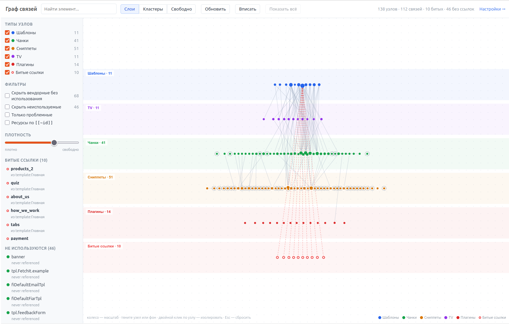

**English** | [Русский](README.ru.md)

# MODX3 MCP

**MODX3 MCP** is an MCP server (**Model Context Protocol**) and a component for **MODX Revolution 3.x**. It lets AI agents work with a website through the structure and API of MODX itself, instead of treating the project as just a database and a set of files.

> **MODX3 MCP does not try to give AI the widest possible access to a website. It tries to give AI the right access to MODX.**

The project is based on the original [**modxMCP**](https://github.com/dampilov94/mcp-component), created by [**dampilov94**](https://github.com/dampilov94). MODX3 MCP has been substantially reworked for MODX Revolution 3.x: the MODX API layer was updated, the operation set was expanded, safety mechanisms were strengthened, and tools for structure and dependency analysis were added.

**Version [1.0.0](https://github.com/rumata-estor/modx3-mcp/releases/tag/v1.0.0) · MODX Revolution 3.x · MIT**

## The idea

Giving an AI agent normal server access means it can edit files, run SQL queries, and execute commands. For MODX, that is not enough. A large part of a MODX site lives in resources, templates, chunks, snippets, TVs, system settings, relations between objects, and data managed by installed extras.

MODX3 MCP gives the agent a dedicated management layer that works with these things as MODX objects. The agent can:

- find resources, templates, chunks, snippets, plugins, and TVs;
- inspect dependencies and where elements are used;
- create, update, and delete MODX objects through controlled operations;
- work with system settings, media sources, and supported extras;
- preview potentially dangerous operations before applying them;
- create safety backups before changes;
- keep read operations separate from write operations;
- send information about completed changes to an external audit log.

The main goal is to make AI work with MODX more **predictable, reviewable, and reversible**.

## Who is it for?

MODX3 MCP is mainly useful for:

- MODX developers and integrators who use AI agents in daily work;
- agencies and teams that maintain several MODX projects;
- owners of complex MODX sites who want controlled AI access to the CMS;
- developers of their own agent systems who need more than generic file, SSH, or database access.

## Why MODX3 MCP is designed this way

MODX3 MCP was not built as a demo showing that an LLM can be connected to a CMS. It was built as a practical tool for working with real websites.

The main risk with an AI agent is not whether it can change a file or a record. The real question is whether it understands the consequences. On a live MODX site, elements rarely exist in isolation. One shared chunk may be used by dozens of resources and templates, a TV may be part of the logic of several sections, and a system setting may affect an entire component.

That is why MODX3 MCP focuses not only on executing commands, but also on context: dependencies, previews, backups, limits for dangerous operations, and auditing.

The goal is not to make the agent all-powerful. The goal is to give it enough context and enough limits so it is less likely to make dangerous decisions blindly.

## Development environment and agent architecture

MODX3 MCP was developed and tested as part of a real agent-based workflow used for practical website maintenance.

For communication between the AI agent and the messaging layer, we used the open-source project [**cc-connect**](https://github.com/chenhg5/cc-connect), created by [**Glenn (chenhg5)**](https://github.com/chenhg5).

In our own workflow, the external interface is built with a **custom Telegram bot and custom server-side scripts**. These tools are kept in a private repository because they are part of our internal infrastructure and our own know-how.

> **MODX3 MCP is a server and a set of tools for an agent. It is not a ready-made agent and it is not tied to Telegram.**

The Node.js part of MODX3 MCP runs as a local MCP server over `stdio`. This means it can be used with any client or agent environment that can start and connect to this type of MCP server: an IDE, a custom agent, an automation system, or a compatible chat interface.

You can write your own agent instructions and define your own rules for how the agent should work with MODX3 MCP. The Telegram bot is only one interface used in our own workflow.

Another part of our internal setup is **AGENT.md** — our own set of system instructions, restrictions, and working rules for an AI agent. It was developed from more than two years of practical work with websites using AI. Some of these rules directly influenced the architecture of MODX3 MCP: dependency analysis, separation of reads and writes, backups, limits around dangerous actions, and auditing.

The Telegram bot, server-side scripts, and AGENT.md are **not dependencies of MODX3 MCP** and are not required to install or use it.

## Common AI mistakes when working with a CMS

| Common problem | What can happen | What MODX3 MCP does |
| --- | --- | --- |
| Changing an element without checking where it is used | A shared chunk, snippet, or TV affects several parts of the site | Lets the agent inspect dependencies and usage |
| Editing the database directly | MODX logic may be bypassed, relations may break, or cache state may become incorrect | Provides dedicated operations for MODX objects |
| Deleting an "unused" object without checking | A hidden dependency is discovered only after part of the site breaks | Helps inspect relations and possible impact before deletion |
| Overwriting settings during an update | API tokens or site-specific values are lost | Preserves existing settings during reinstall and upgrade |
| Several changes running at the same time | One process may overwrite the result of another | Uses locking for write operations |
| Failure during a component upgrade | The component may be left only partly updated | Prepares the new file tree separately and restores the previous one on failure |
| Giving the agent too much access | A mistake affects more objects than necessary | Lets you disable and restrict capability groups |
| No action history | It becomes difficult to understand what the agent actually changed | Supports an external operation log and audit data |

## How this approach is different

MODX3 MCP does not replace SSH, SQL, or file access. It solves a different problem: it gives AI an interface where MODX objects still keep their meaning.

| Approach | What the agent gets | Main limitation |
| --- | --- | --- |
| SSH and shell access | Broad access to the server and system commands | Wide permissions, but little understanding of CMS structure |
| Direct SQL access | Read and write access to database tables | Bypasses application logic and gives little context about object relations |
| Generic file MCP | Access to source code and the file system | A large part of MODX structure is not stored in files |
| Generic database MCP | Access to tables and queries | Tables do not explain MODX object semantics to the agent |
| MODX3 MCP | Dedicated operations for MODX entities and their relations | The agent is limited to capabilities explicitly implemented and allowed by the server |

MODX3 MCP deliberately does not give AI arbitrary access to the whole server. Instead, it gives the agent a narrower but more meaningful interface: a resource stays a resource, a chunk stays a chunk, a TV stays a TV, and dependencies between them can be inspected before a change is made.

## Example task

For example, you can ask an agent:

> "Increase the price of products in a specific category by 100. First find where the price is stored, check which objects will be affected, and only then make the changes."

Instead of editing database tables directly, the agent can use MODX3 MCP to inspect the project structure, identify the right entities, review related objects, perform the change through available operations, and record the result.

## Features

The server side of MODX3 MCP exposes more than 180 operations, which the client presents as specialised MCP tools.

It supports:

- resources and the site tree;
- templates, chunks, and snippets;
- plugins and events;
- TVs and TV values;
- categories and system settings;
- namespaces;
- media sources and files;
- user groups and access control;
- property sets and contexts;
- packages, extras, and lexicons;
- MIGX, miniShop2, VersionX, and VirtualPage.

Individual capability groups can be disabled in the component settings.

## Dependency analysis

One of the key features of MODX3 MCP is a dependency graph for site elements.

[](docs/images/dependency-graph.png)

*MODX3 MCP dependency graph in the MODX manager: relations between templates, chunks, snippets, TVs, and plugins, plus detected broken references and unused elements.*

The agent can find:

- which chunks and snippets are used by a template;
- which TVs are assigned to templates;
- which elements call other elements;
- where a specific element is used;
- references to elements that do not exist;
- elements that are likely no longer used;
- which parts of the site may be affected by a change.

The graph is available through MCP and also as a dedicated screen in the MODX manager. This is especially useful on larger projects, where changing one element may affect several different sections of the site.

## Safety mechanisms

MODX3 MCP is designed not only for reading data, but also for real work on live websites. Depending on the operation, it supports:

- automatic safety backups before changes;
- previewing changes without applying them;
- extra confirmation for destructive operations;
- locking of parallel write operations;
- restricting available capability groups;
- separate permission for running arbitrary MODX processors;
- HTTPS required for the API by default;
- safe API-token comparison;
- automatic selection of an active MODX user with `sudo` permission;
- preservation of existing settings and API token during component upgrades.

## Limits and trust model

MODX3 MCP does not make AI error-free. An LLM can still misunderstand a task, select the wrong object, or suggest an unwanted change.

The component reduces technical risk and gives the agent more context, but it does not replace proper backups, access control, or human review of critical changes. Extra care is recommended for bulk operations, access-control changes, system settings, custom PHP code, and operations provided by third-party extras.

On a production site, it is best to allow only the capability groups that are actually needed.

## External audit hook

For integration with your own audit system, the client supports the `MODX_MCP_AUDIT_HOOK` environment variable.

After a successful write operation, the client can start a configured local program and send JSON to its standard input. The payload includes the MCP tool name, arguments, result, site identifier, actor information, and paths to automatically created safety backups.

The program is started directly, without a shell. If the audit hook is not configured, normal MODX3 MCP behaviour does not change. If the hook itself fails, an already successful site change is not reported as failed. Read-only operations do not trigger the hook.

## Compatibility

MODX3 MCP targets:

**MODX Revolution >= 3.0.0 and < 4.0.0**

Most development and practical testing of version 1.0.0 was done on **MODX Revolution 3.2.4-pl**.

Processor compatibility and core operations were also checked against:

- MODX Revolution 3.2.2-pl;
- MODX Revolution 3.2.4-pl;
- the current MODX Revolution 3.x branch.

Running the local MCP server requires **Node.js 18 or newer**.

## Quick start

A minimal working setup is:

1. Install the MODX3 MCP transport package.
2. Get the automatically generated API token.
3. Configure your MCP client to start MODX3 MCP.
4. Begin with a safe read-only task, for example: "Show me the project structure and the dependencies of template X."

After that, you can move to more complex workflows and enable only the capability groups you actually need.

## Install with the MODX transport package

For a normal installation, use the ready-made transport package:

`modx3mcp-1.0.0-pl.transport.zip`

It is available in the [MODX3 MCP 1.0.0 release](https://github.com/rumata-estor/modx3-mcp/releases/tag/v1.0.0) and can be installed with the standard MODX package manager.

The installation creates the MODX3 MCP component, `modxmcp.*` system settings, namespace, manager menu items, API endpoint, and dependency-graph screen. The API token is generated automatically on first install.

Existing settings and the API token are preserved during reinstall or upgrade.

## Command-line installation

For servers managed by an agent or automation system, the component can also be installed without registering the package in the MODX package manager:

```bash
php _build/install.headless.php
```

If `config.core.php` is outside the project tree:

```bash
MODX_CONFIG_CORE=/full/path/to/config.core.php php _build/install.headless.php
```

The installer checks the MODX version, creates the required settings and menu entries, installs the component files, and generates an API token when needed. New files are prepared in temporary directories first; if installation fails, the previous directories are restored.

The installer is CLI-only and does not create a browser-accessible installation endpoint.

## Configure an MCP client

For the stable 1.0.0 release:

```json
{
  "mcpServers": {
    "modx": {
      "command": "npx",
      "args": [
        "-y",
        "github:rumata-estor/modx3-mcp#v1.0.0"
      ],
      "env": {
        "MODX_MCP_SITE_URL": "https://example.com/assets/components/modxmcp/api.php",
        "MODX_MCP_TOKEN": "your-token"
      }
    }
  }
}
```

For development, use the `modx3` branch instead of a release tag:

```text
github:rumata-estor/modx3-mcp#modx3
```

For production sites, pinning a specific release is recommended.

## Release checks

Before a release, the project checks:

- PHP syntax and Node.js client syntax;
- version consistency and client/server action consistency;
- installation portability and safe default settings;
- processor compatibility across several MODX 3 versions;
- transport-package installation, reinstall with settings preserved, and clean uninstall.

A full test cycle on a separate test site can be run with:

```bash
MODX_CONFIG_CORE=/full/path/to/config.core.php bash _build/release.smoke.sh
```

Before version 1.0.0 was published, we also performed a clean installation on MODX Revolution 3.2.4-pl and tested the MCP server, changes to test objects, reinstall with settings preserved, and complete component removal.

## Project origin

MODX3 MCP is based on the open-source [**modxMCP**](https://github.com/dampilov94/mcp-component) project, created by [**dampilov94**](https://github.com/dampilov94).

The original work and attribution are preserved in the project history and license. MODX3 MCP develops that base into a tool for practical AI-agent work with MODX Revolution 3.x, with dependency analysis, controlled write operations, backups, and auditing.

## License and release

The project is distributed under the **MIT License**. See [LICENSE](LICENSE).

Current stable release: **[MODX3 MCP 1.0.0](https://github.com/rumata-estor/modx3-mcp/releases/tag/v1.0.0)**.

The release includes the source archive, the MODX transport package, and a SHA-256 checksum file.

MODX3 MCP can be installed and configured independently using the documentation. In real projects, integration often needs additional work around access permissions, safe workflows, backups, auditing, third-party extras, and the structure of a particular site. This usually requires separate engineering work for the specific project.
